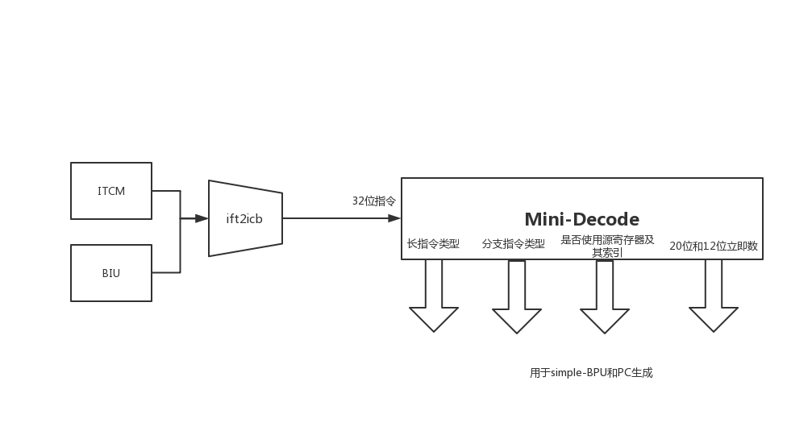

# IFU

## 1 IFU设计

### 1.1 IFU 功能

1. 生成下条指令的 PC

    正常情况下，生成下条指令的 PC 需区分以下 2 种情况（需做简单译码）：

    - 当前指令为顺序指令，PC 直接递增

    - 当前指令为分支指令，需做分支预测

    除此之外，IFU 还可能接受到 流水线冲刷 请求 和 Reset 请求，这两种情况下，直接使用同时传来的对应 PC 值。

2. 根据当前 PC 取指

    IFU 根据 PC 访问 ITCM 或 BIU，取出指令后，将其内容放于 IR，将该指令对应 PC 放于PC，两者供 EXU 访问。

### 1.2 模块划分：

- IFU
    - ifetch（生成下条指令的 PC）
        - mini-decode
        - simple-bpu
        - 其它逻辑
    - ift2icb（根据当前 PC 取指，对 ITCM 和 BIU 的访问控制）

### 1.3 IFU对外接口示意图


### 1.4 输入输出信号说明

```verilog
module e203_ifu(
  output[`E203_PC_SIZE-1:0] inspect_pc,		// 下一条指令的 PC
  output ifu_active,						// IFU 是否在工作，永真
  input  itcm_nohold,						// 来源存疑，用于判断 ITCM 的输出值是否不变

  input  [`E203_PC_SIZE-1:0] pc_rtvec,  	// reset 指定的 PC
  `ifdef E203_HAS_ITCM //{
  input  ifu2itcm_holdup,							// ITCM 的输出值是否保持不变
  input [`E203_ADDR_SIZE-1:0] itcm_region_indic,	// ITCM地址范围

  //////////////////////////////////////////////////////////////
  //////////////////////////////////////////////////////////////
  // 对 ITCM 的总线接口，ICB 协议
  //    * Bus cmd channel
  output ifu2itcm_icb_cmd_valid, // Handshake valid
  input  ifu2itcm_icb_cmd_ready, // Handshake ready
            // Note: The data on rdata or wdata channel must be naturally
            //       aligned, this is in line with the AXI definition
  output [`E203_ITCM_ADDR_WIDTH-1:0]   ifu2itcm_icb_cmd_addr,	// 总线访问地址

  //    * Bus RSP channel
  input  ifu2itcm_icb_rsp_valid, // Response valid 
  output ifu2itcm_icb_rsp_ready, // Response ready
  input  ifu2itcm_icb_rsp_err,   // Response error
            // Note: the RSP rdata is inline with AXI definition
  input  [`E203_ITCM_DATA_WIDTH-1:0] ifu2itcm_icb_rsp_rdata,	// 取得的数据（一个 lane）
  `endif//}

  `ifdef E203_HAS_MEM_ITF //{
  //////////////////////////////////////////////////////////////
  //////////////////////////////////////////////////////////////
  // 对 BIU 的总线接口，ICB 协议
  //    * Bus cmd channel
  output ifu2biu_icb_cmd_valid, // Handshake valid
  input  ifu2biu_icb_cmd_ready, // Handshake ready
            // Note: The data on rdata or wdata channel must be naturally
            //       aligned, this is in line with the AXI definition
  output [`E203_ADDR_SIZE-1:0]   ifu2biu_icb_cmd_addr, 		  // 总线访问地址

  //    * Bus RSP channel
  input  ifu2biu_icb_rsp_valid, // Response valid 
  output ifu2biu_icb_rsp_ready, // Response ready
  input  ifu2biu_icb_rsp_err,   // Response error
            // Note: the RSP rdata is inline with AXI definition
  input  [`E203_SYSMEM_DATA_WIDTH-1:0] ifu2biu_icb_rsp_rdata, // 取得的数据

  `endif//}

  //////////////////////////////////////////////////////////////
  //////////////////////////////////////////////////////////////
  // 对 EXU 的接口，包含 IR 和对应指令的 PC 及其它信息
  output [`E203_INSTR_SIZE-1:0] ifu_o_ir,// The instruction register
  output [`E203_PC_SIZE-1:0] ifu_o_pc,   // The PC register along with
  output ifu_o_pc_vld,
  output ifu_o_misalgn,                  // The fetch misalign 
  output ifu_o_buserr,                   // The fetch bus error
  output [`E203_RFIDX_WIDTH-1:0] ifu_o_rs1idx,
  output [`E203_RFIDX_WIDTH-1:0] ifu_o_rs2idx,
  output ifu_o_prdt_taken,               // The Bxx is predicted as taken
  output ifu_o_muldiv_b2b,               
  output ifu_o_valid, // Handshake signals with EXU stage
  input  ifu_o_ready,

  // 处理 流水线冲刷
  output  pipe_flush_ack,
  input   pipe_flush_req,
  input   [`E203_PC_SIZE-1:0] pipe_flush_add_op1,  
  input   [`E203_PC_SIZE-1:0] pipe_flush_add_op2,
  `ifdef E203_TIMING_BOOST//}
  input   [`E203_PC_SIZE-1:0] pipe_flush_pc,  
  `endif//}

  // 来源存疑，用于停止 IFU 取新的指令而只处理正在处理的指令，当 IFU 对当前指令处理完成时 通过 ifu_halt_ack 响应
  input  ifu_halt_req,
  output ifu_halt_ack,

  // 无 OITF
//   input  oitf_empty,
  // RF 的状态，上条指令的类型
  input  [`E203_XLEN-1:0] rf2ifu_x1,
  input  [`E203_XLEN-1:0] rf2ifu_rs1,
  input  dec2ifu_rden,
  input  dec2ifu_rs1en,
  input  [`E203_RFIDX_WIDTH-1:0] dec2ifu_rdidx,
  input  dec2ifu_mulhsu,
  input  dec2ifu_div   ,
  input  dec2ifu_rem   ,
  input  dec2ifu_divu  ,
  input  dec2ifu_remu  ,

  input  clk,
  input  rst_n
  );
```

## 2 ifetch

- 功能：生成下条指令 的 PC
- 实例化了两个子模块 Mini-Decode、Simple-BPU，依次完成预译码、静态分支预测功能；
- 根据指令类型、是否有流水线冲刷、是否有 Reset 生成 PC
- 生成与 ift2icb 交互的信号，用于取指

### 2.1 模块对外接口示意图


### 2.2 输入输出信号说明

```verilog
module e203_ifu_ifetch(
  output[`E203_PC_SIZE-1:0] inspect_pc,   // 下一条指令的PC


  input  [`E203_PC_SIZE-1:0] pc_rtvec,    // reset指定的PC
  //////////////////////////////////////////////////////////////
  //////////////////////////////////////////////////////////////
  // 取指单元对Memory系统（实际访问 ifu_ift2icb）的接口，使用内部总线协议
  //    * IFetch REQ channel
  output ifu_req_valid, // Handshake valid
  input  ifu_req_ready, // Handshake ready
            // Note: the req-addr can be unaligned with the length indicated
            //       by req_len signal.
            //       The targetd (ITCM, ICache or Sys-MEM) ctrl modules 
            //       will handle the unalign cases and split-and-merge works
  output [`E203_PC_SIZE-1:0] ifu_req_pc, // Fetch PC
  output ifu_req_seq, // This request is a sequential instruction fetch
  output ifu_req_seq_rv32, // This request is incremented 32bits fetch
  output [`E203_PC_SIZE-1:0] ifu_req_last_pc, // The last accessed
                                           // PC address (i.e., pc_r)
  //    * IFetch RSP channel
  input  ifu_rsp_valid, // Response valid 
  output ifu_rsp_ready, // Response ready
  input  ifu_rsp_err,   // Response error
            // Note: the RSP channel always return a valid instruction
            //   fetched from the fetching start PC address.
            //   The targetd (ITCM, ICache or Sys-MEM) ctrl modules 
            //   will handle the unalign cases and split-and-merge works
  input  [`E203_INSTR_SIZE-1:0] ifu_rsp_instr, // Response instruction

  //////////////////////////////////////////////////////////////
  //////////////////////////////////////////////////////////////
  // The IR stage to EXU interface
  output [`E203_INSTR_SIZE-1:0] ifu_o_ir,// IR （32位指令）
  output [`E203_PC_SIZE-1:0] ifu_o_pc,   // 相应的 PC
  output ifu_o_pc_vld,
  output [`E203_RFIDX_WIDTH-1:0] ifu_o_rs1idx,
  output [`E203_RFIDX_WIDTH-1:0] ifu_o_rs2idx,
  output ifu_o_prdt_taken,               // The Bxx is predicted as taken
  output ifu_o_misalgn,                  // The fetch misalign，存疑
  output ifu_o_buserr,                   // The fetch bus error
  output ifu_o_muldiv_b2b,               // mul/div 类的指令，分别连续进行两次（back to back)
  // Handshake signals with EXU stages
  output ifu_o_valid,         
  input  ifu_o_ready,

  // 流水线冲刷的握手信号和其传来的新地址
  output  pipe_flush_ack,
  input   pipe_flush_req,
  input   [`E203_PC_SIZE-1:0] pipe_flush_add_op1,  
  input   [`E203_PC_SIZE-1:0] pipe_flush_add_op2,
  `ifdef E203_TIMING_BOOST//}
  input   [`E203_PC_SIZE-1:0] pipe_flush_pc,  
  `endif//}

      
  // 来源存疑，用于停止 IFU 取新的指令而只处理正在处理的指令，当 IFU 对当前指令处理完成时 通过 ifu_halt_ack 响应
  input  ifu_halt_req,
  output ifu_halt_ack,

// 无 OITF
//   input  oitf_empty,
  // RF 的状态，上条指令的类型
  input  [`E203_XLEN-1:0] rf2ifu_x1,
  input  [`E203_XLEN-1:0] rf2ifu_rs1,
  input  dec2ifu_rs1en,
  input  dec2ifu_rden,
  input  [`E203_RFIDX_WIDTH-1:0] dec2ifu_rdidx,
  input  dec2ifu_mulhsu,
  input  dec2ifu_div   ,
  input  dec2ifu_rem   ,
  input  dec2ifu_divu  ,
  input  dec2ifu_remu  ,

  input  clk,
  input  rst_n
  );
```

## 3 Mini-Decode

- 该模块仅需译出部分信息，因而为 mini 译码器，具体需译出信息如下：
  1. 是否是长指令（乘除法、访存）
  2. 是否是分支跳转指令（jal, jalr, beq, bne等）
  3. 直接传出 操作数1、操作数2的寄存器索引， jalr指令的寄存器索引
- 该模块内部通例化调用一个完整的 Decode 模块，但是将其不相关的输入信号接零、输出信号悬空不连接，从而使得综合工具将完整 Decode 模块中无关逻辑优化掉，成为一个 Mini-Decode；

### 3.1 模块对外接口示意图



### 3.2 输入输出信号说明

```verilog
  module e203_ifu_minidec(
      input [`E203_INSTR_SIZE-1:0] instr,             // 32位指令（刚由ITCM或BIU取出，还未存入 IR）
      output dec_rs1en,                               // 是否使用源寄存器1
      output dec_rs2en,                               // 是否使用源寄存器2
      output [`E203_RFIDX_WIDTH-1:0] dec_rs1idx,      // 源寄存器1的索索引
      output [`E203_RFIDX_WIDTH-1:0] dec_rs2idx,      // 源寄存器2的索索引
      output dec_mulhsu,                              // 是否是 mulhsu 指令
      output dec_mul,                                 // 是否是 mul 指令
      output dec_div,                                 // 是否是 div 指令
      output dec_rem,                                 // 是否是 rem 指令
      output dec_divu,                                // 是否是 无符号除法
      output dec_remu,                                // 是否是 remu 指令

      output dec_rv32,								  // 是否是32位指令
      output dec_bjp,                                 // 是否是 条件跳转指令
      output dec_jal,                                 // 是否是 jal
      output dec_jalr,                                // 是否是 jalr
      output dec_bxx,                                 // 是否是 其它的分支跳转指令
      output [`E203_RFIDX_WIDTH-1:0] dec_jalr_rs1idx, // jalr 使用的基地址寄存器索索引
      output [`E203_XLEN-1:0] dec_bjp_imm          // 由指令中的12位或20位立即数零扩展得到的32位立即数
  ); 
```

## 4 Simple-BPU

- 该模块的功能是：对Mini-Decode发现的条件跳转指令进行分支预测；
- 该模块采用静态分支预测策略
    - 得益于RISC-V 架构明确提供了对于静态预测的依据，因此对于向后跳转的条件分支指令预测为跳转，对向前跳转的条件分支指令预测为不需跳转
    - 对于无条件跳转指令，一定跳转

### 4.1 模块对外接口示意图


### 4.2 输入输出信号说明

```verilog
 module e203_ifu_litebpu(
     input [`E203_PC_SIZE-1:0] pc,                  // 当前的 PC

     // mini-decoded 输出
     input dec_jal,                                 // 是否是 jal 指令
     input dec_jalr,                                // 是否是 jalr 指令
     input dec_bxx,                                 // 是否是 条件跳转指令
     input [`E203_XLEN-1:0] dec_bjp_imm,            // 零扩展得到的32位立即数表示的偏移量
     input [`E203_RFIDX_WIDTH-1:0] dec_jalr_rs1idx, // jalr 使用的基地址寄存器索引

     // IR，无 OITF
     // input  oitf_empty,
     input ir_empty,                                // IR 是否为空（是否有指令处于EXU）
     input ir_rs1en,                                // IR 是否使用 rs1读端口
     input jalr_rs1idx_cam_irrdidx,                 // 处于 IR 的指令的写回目标寄存器索引是否为x1

     // 用于 PC 生成的输出
     output bpu_wait,                               // bpu 是否处于 wait
     output prdt_taken,                             // 是否采取分支预测
     output [`E203_PC_SIZE-1:0] prdt_pc_add_op1,    // 分支预测的 op1
     output [`E203_PC_SIZE-1:0] prdt_pc_add_op2,    // 分支预测的 op2

     // 读寄存器组（x1 和 读端口1）
     output bpu2rf_rs1_ena,                         // 寄存器读端口1 的使能
     input ir_valid_clr,                            // IR 正处于 clear
     input [`E203_XLEN-1:0] rf2bpu_x1,              // 寄存器x1的数据直接拉出（x1常被用为link寄存器，因此做特别加速）
     input [`E203_XLEN-1:0] rf2bpu_rs1,             // 其它寄存器的数据，统一从寄存器读端口1 读出

     input dec_i_valid,                             // 指令是否合法

     // SoC
     input clk,
     input rst_n);
```

## 5 ift2icb

- 该模块的功能是：根据 PC 访问 ITCM 或 BIU 以取指
- 其生成 2 个 ICB接口，分别用于访问 ITCM（数据宽度64位）和 BIU （数据宽度32位）
- 根据 PC 地址区间 判断访问 ITCM 或 外部存储
- 只支持边界对齐的32位指令

### 5.1 模块对外接口示意图


###	5.2 输入输出信号说明

```verilog
module e203_ifu_ift2icb(

  input  itcm_nohold,
  //////////////////////////////////////////////////////////////
  //////////////////////////////////////////////////////////////
  // 与 ifetch 的通信接口, 内部协议
  //    * IFetch REQ channel
  input  ifu_req_valid, // Handshake valid
  output ifu_req_ready, // Handshake ready
            // Note: the req-addr can be unaligned with the length indicated
            //       by req_len signal.
            //       The targetd (ITCM, ICache or Sys-MEM) ctrl modules 
            //       will handle the unalign cases and split-and-merge works
  input  [`E203_PC_SIZE-1:0] ifu_req_pc, // 取指地址（当前 PC ）
  input  ifu_req_seq, 				     // 顺序指令
  input  ifu_req_seq_rv32, 				 // 32位 顺序指令
  input  [`E203_PC_SIZE-1:0] ifu_req_last_pc, // 上条指令的 PC，用于判断 lane
                             
  //    * IFetch RSP channel
  output ifu_rsp_valid, // Response valid 
  input  ifu_rsp_ready, // Response ready
  output ifu_rsp_err,   // Response error
            // Note: the RSP channel always return a valid instruction
            //   fetched from the fetching start PC address.
            //   The targetd (ITCM, ICache or Sys-MEM) ctrl modules 
            //   will handle the unalign cases and split-and-merge works
  output [32-1:0] ifu_rsp_instr,		 // 取得的指令


// 访问 ITCM 的 ICB 接口
  `ifdef E203_HAS_ITCM //{
  //////////////////////////////////////////////////////////////
  //////////////////////////////////////////////////////////////
  // ITCM 地址范围
  input [`E203_ADDR_SIZE-1:0] itcm_region_indic,
  // 对 ITCM 的总线接口, ICB 协议
  //    * Bus cmd channel
  output ifu2itcm_icb_cmd_valid, // Handshake valid
  input  ifu2itcm_icb_cmd_ready, // Handshake ready
            // Note: The data on rdata or wdata channel must be naturally
            //       aligned, this is in line with the AXI definition
  output [`E203_ITCM_ADDR_WIDTH-1:0]   ifu2itcm_icb_cmd_addr, // 总线访问地址

  //    * Bus RSP channel
  input  ifu2itcm_icb_rsp_valid, // Response valid 
  output ifu2itcm_icb_rsp_ready, // Response ready
  input  ifu2itcm_icb_rsp_err,   // Response error
            // Note: the RSP rdata is inline with AXI definition
  input  [`E203_ITCM_DATA_WIDTH-1:0] ifu2itcm_icb_rsp_rdata,  // 取得的指令

  `endif//}


// 访问 BIU 的 ICB 接口
  `ifdef E203_HAS_MEM_ITF //{
  //////////////////////////////////////////////////////////////
  //////////////////////////////////////////////////////////////
  // 对 System Memory(通过BIU间接访问) 的总线接口
  //    * Bus cmd channel
  output ifu2biu_icb_cmd_valid, // Handshake valid
  input  ifu2biu_icb_cmd_ready, // Handshake ready
            // Note: The data on rdata or wdata channel must be naturally
            //       aligned, this is in line with the AXI definition
  output [`E203_ADDR_SIZE-1:0]   ifu2biu_icb_cmd_addr, 			// 总线访问地址

  //    * Bus RSP channel
  input  ifu2biu_icb_rsp_valid, // Response valid 
  output ifu2biu_icb_rsp_ready, // Response ready
  input  ifu2biu_icb_rsp_err,   // Response error
            // Note: the RSP rdata is inline with AXI definition
  input  [`E203_SYSMEM_DATA_WIDTH-1:0] ifu2biu_icb_rsp_rdata, 	// 取得的指令
  
  //input  ifu2biu_replay,
  `endif//}


  // The holdup indicating the target is not accessed by other agents 
  // since last accessed by IFU, and the output of it is holding up
  // last value. 
  `ifdef E203_HAS_ITCM //{
  input  ifu2icm_holdup,		// ITCM 输出是否保持不变
  `endif//}

  input  clk,
  input  rst_n
  );
```

